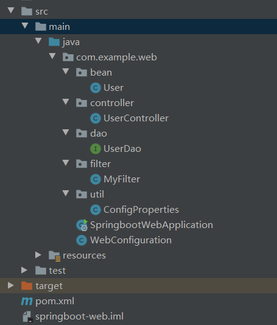

# springboot-web
- **SpringBoot Web开发非常简单，包括json输出、自定义filter、property、data操作等**
## 项目结构

## json 接口开发
* 需要类添加 @RestController 即可，默认类中的方法都会以 json 的格式返回
## 自定义 Filter
### 两个步骤：
1. 实现 Filter 接口，实现 Filter 方法
2. 添加@Configuration 注解，将自定义Filter加入过滤链
```java
@Configuration
public class WebConfiguration {
    @Bean
    public RemoteIpFilter remoteIpFilter() {
        return new RemoteIpFilter();
    }
    
    @Bean
    public FilterRegistrationBean testFilterRegistration() {

        FilterRegistrationBean registration = new FilterRegistrationBean();
        registration.setFilter(new MyFilter());
        registration.addUrlPatterns("/*");
        registration.addInitParameter("paramName", "paramValue");
        registration.setName("MyFilter");
        registration.setOrder(1);
        return registration;
    }
    
    public class MyFilter implements Filter {
		@Override
		public void destroy() {
			// TODO Auto-generated method stub
		}

		@Override
		public void doFilter(ServletRequest srequest, ServletResponse sresponse, FilterChain filterChain)
				throws IOException, ServletException {
			// TODO Auto-generated method stub
			HttpServletRequest request = (HttpServletRequest) srequest;
			System.out.println("this is MyFilter,url :"+request.getRequestURI());
			filterChain.doFilter(srequest, sresponse);
		}

		@Override
		public void init(FilterConfig arg0) throws ServletException {
			// TODO Auto-generated method stub
		}
    }
}
```
## 自定义 Property
- 配置在 application.properties 中
```properties
config.title=CSDN
config.description=分享技术的网站
```
- 自定义配置类
```java 
@Component
public class NeoProperties {
	@Value("${config.title}")
    private String title;
    @Value("${config.description}")
	private String description;

	//省略getter settet方法
}
```
